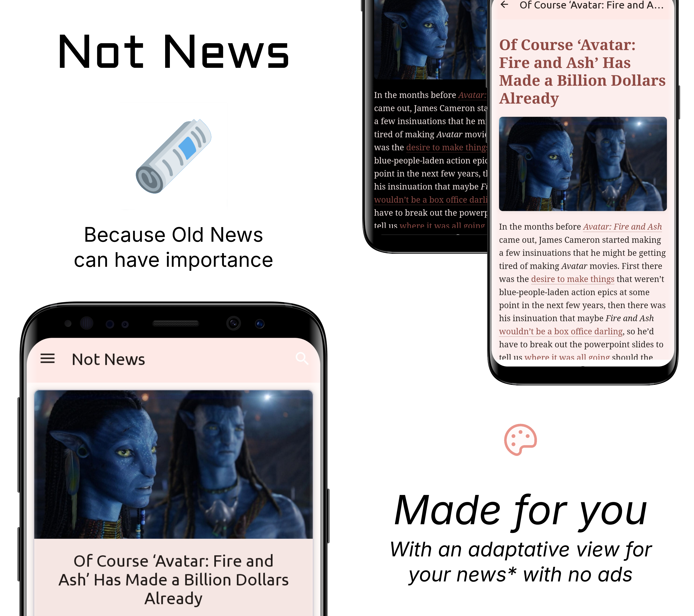

# NotNews

### A simple news app built with Kotlin, Retrofit, Hilt, Dagger.

## What can you do with this app?
----
Retrieves news from api and serves them in the format you want. 
There are 3 modes:
* (***No WebView***): The app is just a feed and when you click it redirects to your preferred browser.
* (***WebView***): The app opens a webview, to the actual web.
* (***LiteWebView***): The app fetch the page, gets it into a *variant of Readability* opens a webview with that code

The app also offers an "offline mode" and adaptative WebView style with the LiteWebView.
The "offline mode" downloads all on first view, then when you are offline you can see it.

### What is variant of Readability thing?
----
Readability.js is the library that is behind the Reader view in Mozilla Firefox.

There are two variants of the library, the Mozilla™️ one,
and the Kotlin port (there is also others, but yet not in
app, or not intended to be in the app).
The app uses them as:

1. First OkHttp fetches the plain page, then it sends to the variant.

2. The Kotlin version runs outside the webview.
The JavaScript one runs inside the webview (with js enabled), first pass the plain html to DOMPurify.js for security,
then to Readability.js, and then, serves it.

## But hey the app is doing nothing!
----
This app is made with [News Api](https://newsapi.org/) in mind (for now), as their developer plan paywalls you the latest news, and the development plan serves you news from 24h before (thereafter *Not New News*). The use of the app as is for development/CV proposes, ***as NewsApi states in their license***:

-----
### *What usage does the Developer plan permit?*

The Developer plan may be used for development and testing in a development environment only, and cannot be used in a staging or production environment (including internally). When the API is used outside of a development environment an upgrade to one of our subscriptions will be required to continue using the API.

---------
So take that in mind if you use it.

Sometimes the api also has heart strokes. So take your time if you're trying.

# What is next?
----
* Add Multiple Api
* Add Feed Sources
* Multiple Queries
* Add by Query/Site/Url (doing a Readability test)
* Add maybe another readability versions (the more implementations the more headaches?)
* A threaded download for see it offline later
* Maybe a better style?

# Licenses
--------------------------------------------
This project is licensed under the MIT License.

### Libraries:
* DOMPurify.js (/assets/js/purify.js) Copyright (c) Cure53 and other contributors | Released under the Apache license 2.0 and Mozilla Public License 2.0
* Readability.js (/assets/js/Readability.js) Copyright (c) 2010 Arc90 Inc Licensed under the Apache License, Version 2.0 (the "License")

### Vectors and icons by:
* App Icon by [Twitter](https://github.com/twitter/twemoji?ref=svgrepo.com) 
in MIT License via [SVG Repo](https://www.svgrepo.com/)
* Monochrome App Icon is under the same license as its a variation of it
* Art by [unDraw](https://undraw.co/) with [License](https://undraw.co/license)
* OldNews icon on the NavBar by [Phosphor](https://github.com/phosphor-icons/phosphor-icons)
in MIT License via [SVG Repo](https://www.svgrepo.com/)

# DISCLAIMER
This application is intended for CV/portfolio demonstration purposes, for now.
All trademarks, logos, and brand names are property of their respective owners.